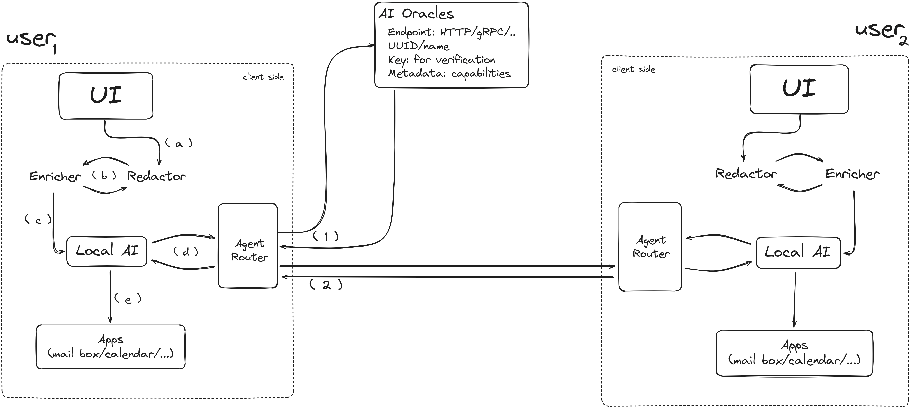

# one-for-all

## 1. Scope 

This document records the current work that combines three components: RAG + (MCP x A2A) = AI agent that runs on the local machine helps choose the right privacy tools.

| Group | Goal | Problem |
| - | - | - |
| **Developer** | Add safe crypto fast | Docs are too long; little time |
| **User** | Finish privacy tasks | Do not know the right words; think it is hard |

Goal:
- *Dev* autocomplete secure code in seconds.
- *User* completes common privacy tasks in one click.
=> help two different groups use privacy tools with less effort

## 2. Main parts

### 2.1 For developers

- Open source project owners should add short, clear sections with complete examples to their documentation. This makes it easier for AI agents to use RAG: the agent can find code hints that use the library, without needing extra training. All RAG processing happens on the developer’s machine, and the source code stays local.

### 2.2 For users

<!-- Building blocks:
| | |
| - | - | 
| MCP |  Every tool and every AI use the same protocol to communicate. No need extra adapters. |
| RAG | A tool that puts more helpful text or data into the message. Gives the AI the context it needs for a good answer. |
| A2A | A way for AIs to ask other AIs for help. Fills any gap when the local machine has no tool or needs another user. |

- **MCP Client** runs on the user’s machine. The AI model is lightweight and should work even on mobile devices.
- **MCP Server** are  tools that run either on the client’s own machine or as public services. They communicate with the MCP Client via the MCP Protocol and are ready to perform requested tasks.
- **Prompt cleaner** removes personal data (such as name, email, IP address, and location) before any message leaves the client’s machine. Only the task idea is sent.
- **RAG** (Retrieval-Augmented Generation) turns user requests into the correct tool calls or makes them more AI-friendly.
- **A2A layer** lets clients call other AI agents for help. These can be public agents or personal agents.
- **MCP Protocol & A2A Protocol** define the capabilities of each tool and agent. For MCP, this is specified in a config file stored on the MCP Client, detailing the URL and capabilities of each MCP Server. Similarly, each agent in the A2A system has an Agent Card that describes its capabilities, authentication key, URL, and how it communicates with others.
- Many tools may join later (prompt-cleaner, RAG, VPN, mail, phone…) as a MCP server, then the local AI can call any new tool without extra code. MCP is the single pipe that keeps everything simple.

#### 2.2.1 End-user view

0. User send a simple request to their AI agent 
1. Local agent turns the user’s words into an MCP message -> finding suitable MCP server:
    1. Prompt cleaner removes personal infor
    2. RAG check their knowledge and enrich the context
    3. Planner reads `task` + `context` and decides which MCP server can solve it.
    4. Planner forwards the same MCP message to each MCP server; each tool does one job and adds `status`.
2. If Planner finds no tool—or needs another user—it broadcasts the A2A message (minus personal info) on A2A hoặc tìm trực tiếp agent phù hợp thông qua it's danh sách agent card. Any agent that can help replies with its agent card, sau đó thực hiện các phần còn lại.
3. Planner dựa trên `status` của jobs và thông báo câu trả lời cuối cùng cho users.

#### 2.2.2 Quick examples (ideally, not tested yet)

0. User sends a request: “I want to watch Movie A on Netflix.”
1. Local AI agent creates an initial MCP message: `{task: "watch_netflix", movie: "A", context: "", clean: false}`
2. The agent calls MCP Servers (local tools) to collect necessary info:
  - Calls a tool to check Netflix catalog: returns `{movie_A_available: false}`
  - Calls a tool to get IP/country: returns `{IP: "1.2.3.4", country: "VN"}`
3. The agent merges these facts into the MCP message:
`{task: "watch_netflix", movie: "A", context: "IP: 1.2.3.4, country: VN, Movie A not available", clean: false}`
4. RAG enriches the prompt:
  - RAG adds public or config-based context (FAQ, generic instructions, etc.):
  `{..., context: "Movie A is not available in Vietnam. A VPN may be required to access it."}`
5. Prompt cleaner removes or masks any sensitive data:
For example, it deletes the IP and exact movie title if necessary:
  `{..., context: "Movie not available in your country. VPN may help."}`
  - Sets `clean: true`
6. Planner decides next action:
  - Checks via MCP if a VPN app/tool is available locally.
7. Act:
  - If a VPN tool is found, the agent instructs it to connect to an appropriate region.
8. If no suitable tool is found, use A2A:
  - The cleaned MCP message is broadcast to other agents via A2A (with NO personal info).
  - Any agent that can help (e.g., suggesting a VPN app or providing a solution) replies with its endpoint or a recommendation.
9. Show result:
  - The local AI agent presents the user with the final result:
  “Movie A is not available on Netflix in your country. Would you like to connect to a VPN or install one?”

* **Only MCP Servers (local tools) fetch personal/device/app info.**
* **RAG only adds general (non-personal) context and cannot access user info.**
* **Prompt Cleaner always runs after info is gathered and before any external (A2A) step.**
* **A2A is only used when a solution cannot be found locally, and the message is always clean.** -->